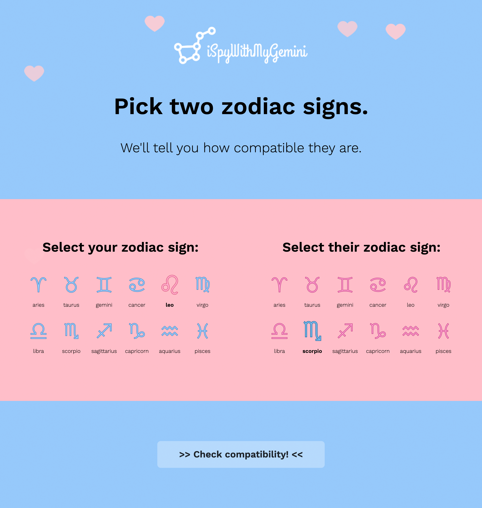
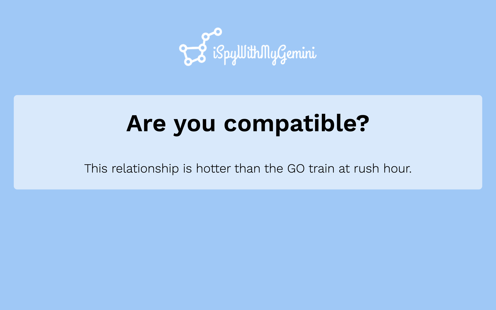

# iSpyWithMyGemini

## Introduction

**iSpyWithMyGemini** is a responsive web app that allows users to look up the romantic compatibility between two zodiac signs. The predictions are not based on research nor meant to be taken seriously--they are purely for entertainment. The not-so-subtle stereotypical pink-and-blue color scheme, animated falling hearts, cupid-style cursor, and hilarious compatibility predictions are guaranteed to make you feel all warm and fuzzy inside!

**View the site here: [http://ispywithmygemini.herokuapp.com/](http://ispywithmygemini.herokuapp.com/).** Note that because the site is hosted on Heroku, it goes to "sleep" after 1 hour of inactivity; please allow the site 5 minutes to "wake up" after opening the link for the first time, then reload the page.

## Screenshots

**Main Page:**

**Result Page:**

## Technologies

- [SCSS](https://sass-lang.com/)
- [React](https://reactjs.org/)
- [Axios](https://github.com/axios/axios)
- [Node](https://nodejs.org/en/)
- [Express](https://expressjs.com/)

## Features

- Read about the love compatibility between any two zodiac signs. Every combination, out of a total of 144 combinations, will yield a unique description!

## Status

This was a pair programming project for BrainStation's Web Development Diploma Program (completed in Toronto, Canada). As a team of two, Yuki and Luca built the app in less than 24 hours and it won the educators' vote for the class's most visually appealing app (out of 11 apps).

Yuki utilized React and SCSS to write the front-end code, and Luca utilized Node and Express to write the back-end code. Both worked together to implement React props, state, and event handlers.

After the course ended, the code was refactored and the app was deployed on Heroku.

## Inspiration

This cheesy site was created to make you chuckle :)

## Contact

Created by [Yuki Kishimoto](https://ca.linkedin.com/in/yukikishimoto) and [Luca Lamanna](https://ca.linkedin.com/in/lucalamanna)